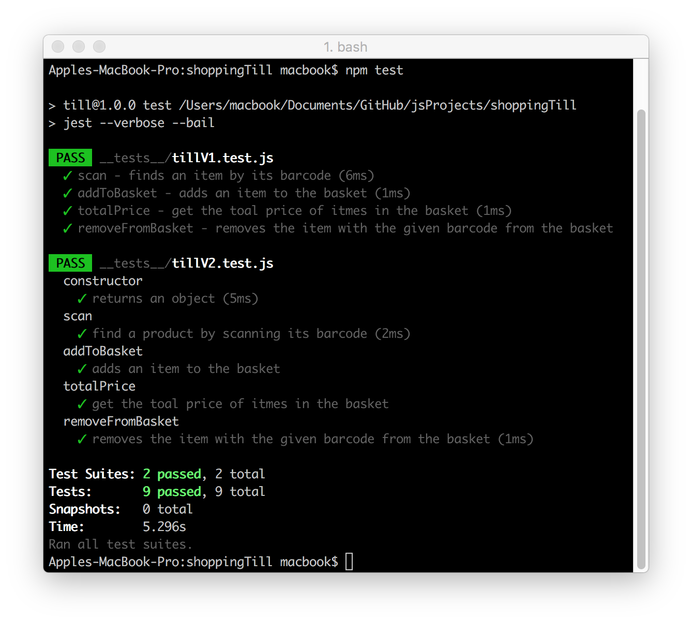

# Shopping Till :moneybag:

You've owned a corner shop for many years, but now the opportunity has come up to move into bigger premises. Your one till will no longer suffice - you need _many_ tills.

## Requirements
* Create a new till with a list of products
* Find a product by scanning its barcode
* Add a product to the basket
* Get total of items in the basket
* Remove a product from the basket by its barcode

### Built With
* [npm](https://www.npmjs.com/) - Node Package Manager
* [Jest](https://facebook.github.io/jest/) - JavaScript Testing Framework

